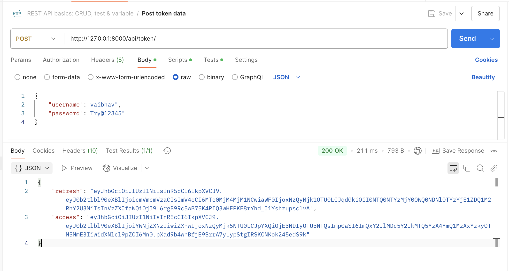
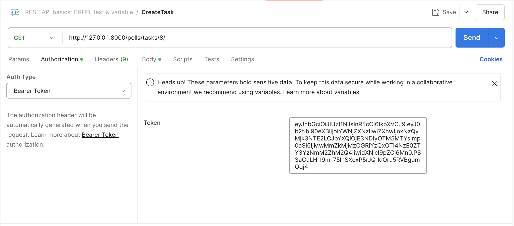
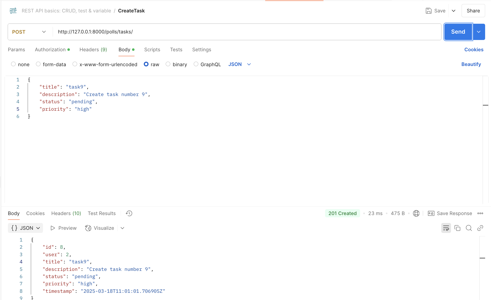
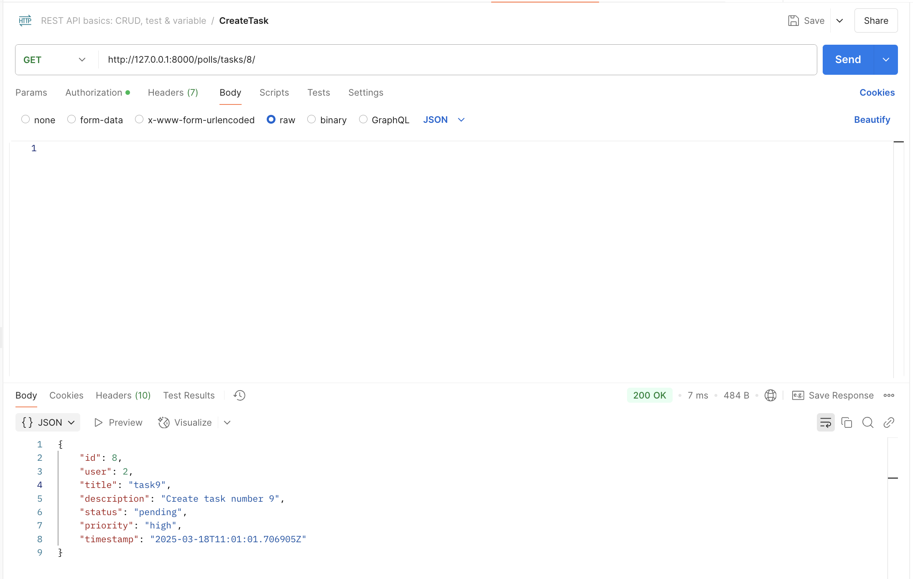
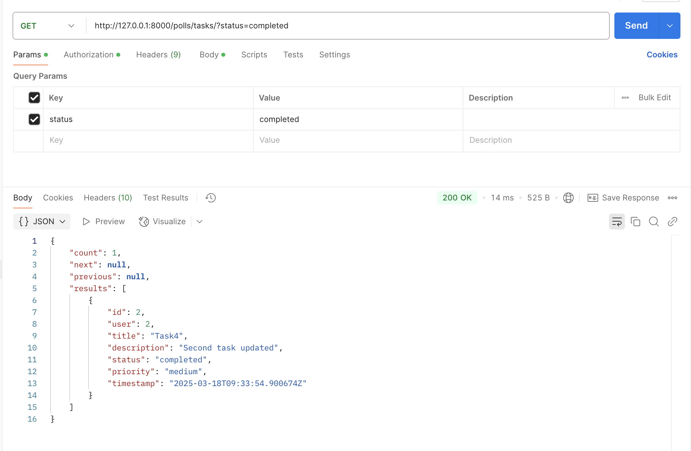
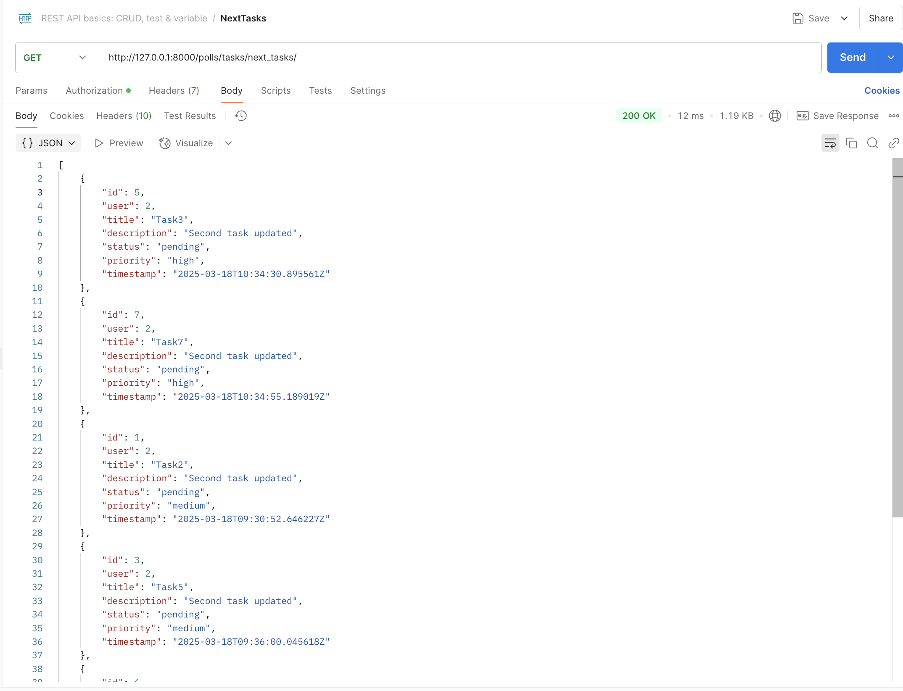

# django-task-management-system

pip install django djangorestframework djangorestframework_simplejwt

# Prerequisites

Before you start, ensure you have the following installed:

Python 3.9+
pip
virtualenv
Django

# Getting Started

## 1. Clone the Repository

git clone https://github.com/vermavaibhav23/django-task-management-system.git
cd django-task-management-system

## 2. Create and Activate a Virtual Environment

python -m venv venv
source venv/bin/activate 

## 3. Install Dependencies

pip install -r requirements.txt

## 4. Apply Migrations and Create Superuser

python manage.py migrate
python manage.py createsuperuser

Follow the prompts to create an admin user.

## 5. Run the Development Server

python manage.py runserver

The API will be accessible at http://127.0.0.1:8000/

# API Endpoints

## Authentication

POST /api/token/ - Obtain JWT token

POST /api/token/refresh/ - Refresh JWT token

## Task Management

GET /polls/tasks/ - List all tasks

POST /polls/tasks/ - Create a new task

GET /polls/tasks/<task_id>/ - Retrieve a specific task

PUT /polls/tasks/<task_id>/ - Update a task

DELETE /polls/tasks/<task_id>/ - Delete a task

GET /polls/tasks/next_tasks/ - Fetch the next pending tasks by priority

## Caching

Tasks are cached per user to reduce DB hits.

Individual tasks are stored using task_<user_id>_<task_id> as cache keys.

Deleting a task clears the corresponding cache entry.

# Demo

## Create Authorization token (JWT based)

## Add token before making any API call

## Create Task

## Get Task by task Id

## List all Tasks based on filter parameters

## Get Next Tasks for scheduling based on priority queue

